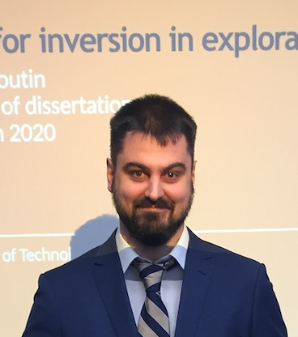

::: {.home-page}
::: {.home-hero}
::: {.hero-copy}

Scientific computing · Open source · Inverse problems

# Turning complex science into usable software

I’m **Mathias Louboutin**, a scientific researcher and software developer
building high-performance tools for wave-based imaging, optimization, and
machine learning.

::: {.hero-actions}
[Explore my research](content/pubs/publications.qmd){.btn .btn-primary}
[View software](content/software/software.qmd){.btn .btn-outline-primary}
:::

Senior Solution Architect at
<a href="https://www.devitocodes.com/">Devito Codes</a> · Python, Julia, HPC,
and cloud computing

:::

::: {.hero-portrait}

Open to research collaborations

:::
:::

::: {.home-section .intro-section}

What I work on

## Research at the intersection of mathematics and computing

I develop computational methods and open-source software that make demanding
scientific problems easier to express, scale, and solve—from a laptop to the
cloud.

::: {.research-grid}
::: {.research-card}
01

### Inverse problems

PDE-constrained optimization for seismic, photoacoustic, and ultrasound
imaging, with an emphasis on practical large-scale solvers.
:::

::: {.research-card}
02

### High-performance computing

Task-parallel methods for exascale simulations, large scientific datasets,
and performance-portable numerical workloads.
:::

::: {.research-card}
03

### Scientific software

Domain-specific languages and symbolic APIs that let researchers describe
complex models without sacrificing computational performance.
:::

::: {.research-card}
04

### Machine learning

Randomized linear algebra and memory-efficient methods that connect modern
learning systems with physics-based computation.
:::
:::
:::

::: {.home-section .work-section}
::: {.section-heading}

Featured work

## Open tools for ambitious science

[See all software →](content/software/software.qmd){.text-link}
:::

::: {.project-grid}
::: {.project-card .project-card-primary}

Python · Compiler · HPC

### Devito

A symbolic finite-difference domain-specific language and just-in-time
compiler that generates optimized C for CPUs and GPUs.

[Visit the Devito project →](https://github.com/devitocodes/devito)
:::

::: {.project-card}

Julia · Linear algebra · Imaging

### JUDI

A matrix-free framework for PDE-constrained optimization that combines a
high-level Julia interface with Devito’s computational performance.

[Explore JUDI →](https://github.com/slimgroup/JUDI.jl)
:::

::: {.project-card}

Learning · Efficiency · Open source

### Memory-efficient ML

Methods and software for scalable learning, including randomized gradients,
reversible networks, and low-memory scientific workflows.

[Browse my publications →](content/pubs/publications.qmd)
:::
:::
:::

::: {.home-section .connect-section}
::: {.connect-copy}

Let’s collaborate

## Have a difficult computational problem?

I enjoy working with researchers and engineering teams on scientific software,
large-scale simulation, imaging, and high-performance computing.
:::

::: {.connect-actions}
[Start a conversation](mailto:mathias.louboutin@gmail.com){.btn .btn-light}
[View my résumé](content/resume.qmd){.connect-link}
:::
:::
:::
